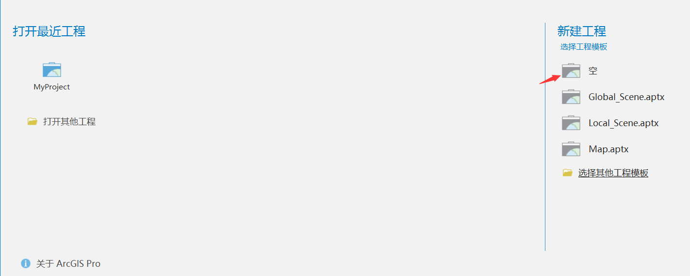
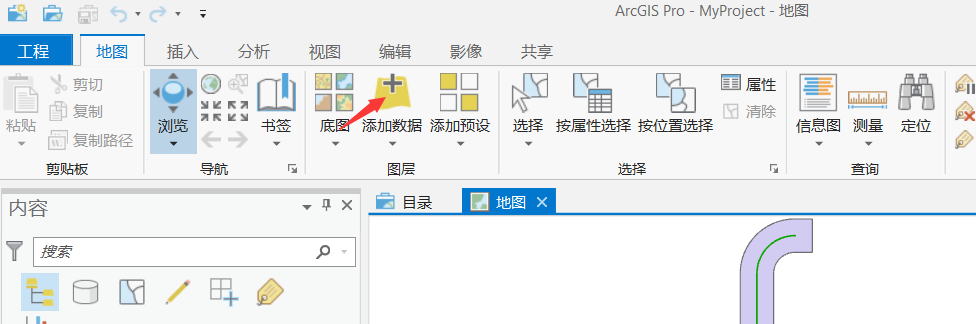
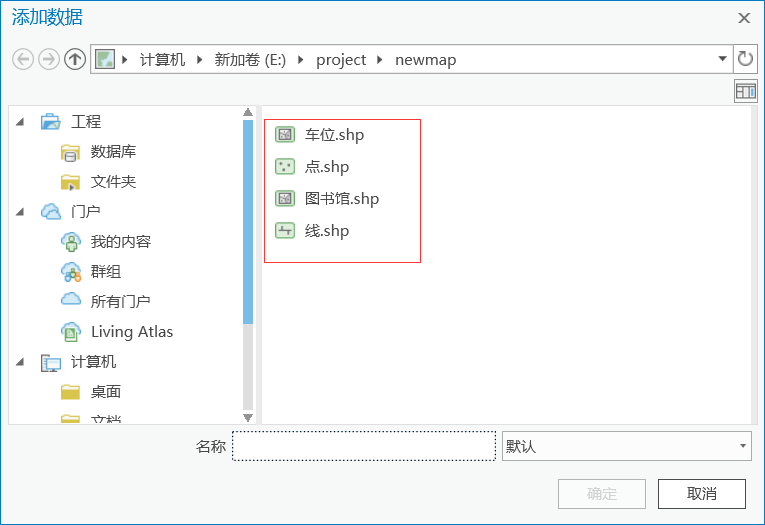
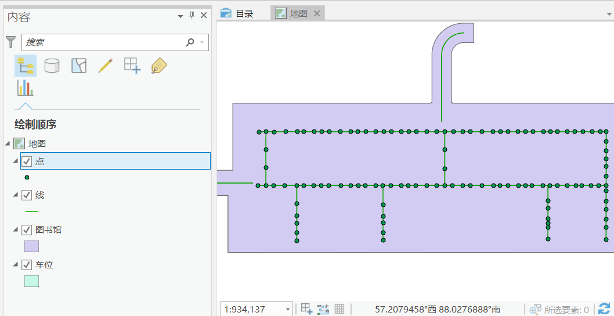
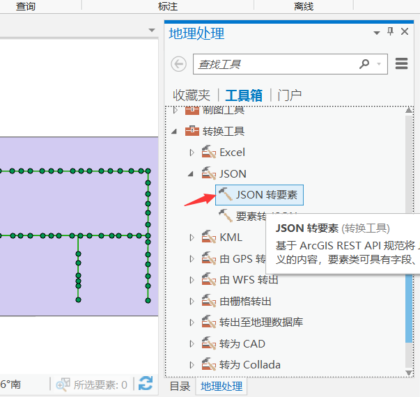
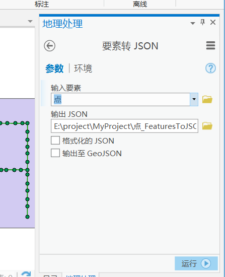

因一个项目需要，需要把地图数据文件转换成 esriJson 文件，以便通过 openlayer 加载 esriJson 矢量数据图层。记录如下：
* 安装 ArcGIS Pro
* 安装完毕后，打开软件，如图选择新建一个空的工程模板 

* 新建工程后，选择地图工具栏，点击添加数据，在弹出的面板中选择要做转换的地图数据文件 

* 此处一共添加了4个图层，如图所示： 

* 添加完毕后，在预览面板中看到渲染的地图
* 点击选择 点 这个图层，在右侧弹出地图处理工具箱，选择转换工具下面的JSON工具，选择 `要素转JSON` 

* 填写转换参数：选择要转换的要素，填写导出的 JSON 文件名 

* 点击运行，运行完毕后，就在文件目录下看到导出的 json 文件了